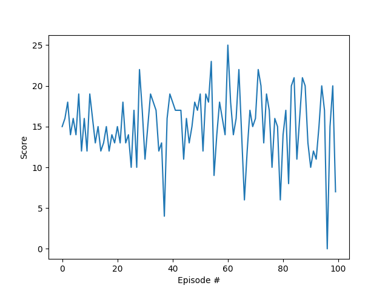

### Implementation details
The agent uses the Udacity implementation of a standard DQN agent.
The following parameters were used for the algorithm:
* Replay buffer size: 100000
* Network is updated on every 4th episode
* Mini batch size: 64
* Gamma: 0.99
* Tau: 1e-3
* learning rate: 0.0005

Epsilon values:
* Start value: 1.0
* Final value: 0.01
* After each episode, epsilon is multiplied by 0.995 to reduce exploration

Q-Network size: A two layer fully connected network with 128 neurons in each layer was used.

### Convergence
The agent usually solves the environment first after 500-600 episodes. 
I used CPU for training, as it was faster than GPU.
To achieve better performance, the agent was trained for 1000 episodes.

### Plot of rewards
The trained agent received an average reward of 15.09 over 100 episodes:

### Future ideas
What could be done to further improve the performance / learning speed:
* Further experiments with different parameters like network size, learning rate and how often to update
* Implement and use improvements developed for the DQN algorithm, like Prioritized Experience Replay or Dueling Q-Networks